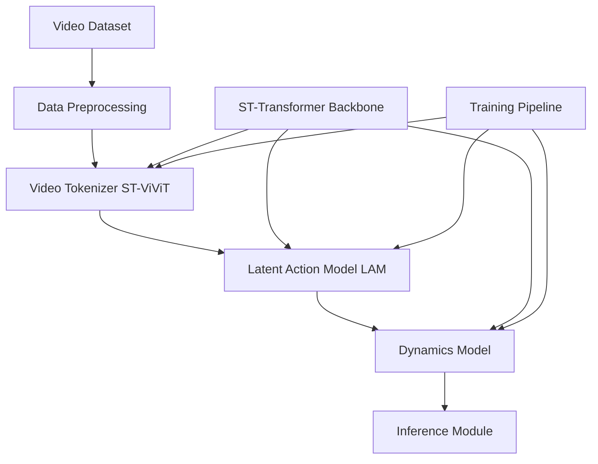

# Genie Model Implementation Plan

## Overview

Implement a minimal skeleton of the Genie model architecture based on `recreate.md`, scaled down for 16GB GPU. All core modules will be implemented with working code that can be trained and tested.

## Architecture Overview



## Directory Structure

```
Genie_SKR/
├── src/
│   ├── __init__.py
│   ├── data/
│   │   ├── __init__.py
│   │   ├── dataset.py          # Video dataset loader with H5 support
│   │   ├── preprocessing.py    # Normalization, augmentation, filtering
│   │   └── transforms.py       # Video transforms
│   ├── models/
│   │   ├── __init__.py
│   │   ├── st_transformer.py   # Core ST-Transformer backbone
│   │   ├── video_tokenizer.py  # ST-ViViT Video Tokenizer
│   │   ├── lam.py              # Latent Action Model
│   │   ├── dynamics.py         # Dynamics Model with MaskGIT
│   │   ├── vq.py               # Vector Quantization codebook
│   │   └── embeddings.py       # Positional embeddings
│   ├── training/
│   │   ├── __init__.py
│   │   ├── trainer.py          # Main training loop
│   │   ├── losses.py           # Loss functions
│   │   └── optimizers.py       # Optimizer and scheduler setup
│   ├── inference/
│   │   ├── __init__.py
│   │   └── generator.py        # Inference and generation
│   └── utils/
│       ├── __init__.py
│       ├── config.py           # Configuration management
│       └── visualization.py   # Visualization utilities
├── configs/
│   ├── tokenizer_config.yaml   # Video tokenizer hyperparameters
│   ├── lam_config.yaml         # LAM hyperparameters
│   └── dynamics_config.yaml    # Dynamics model hyperparameters
├── scripts/
│   ├── train_tokenizer.py
│   ├── train_lam.py
│   ├── train_dynamics.py
│   └── inference.py
├── requirements.txt
└── README.md
```

## Implementation Details

### 1. Configuration System (`src/utils/config.py`)

- YAML-based configuration loader
- Scaled-down hyperparameters for 16GB GPU:
  - **Video Tokenizer**: 6 layers, d_model=384, num_heads=6, k/q_size=64 (vs original 12/512/8/64)
  - **LAM**: 8 layers, d_model=512, num_heads=8, k/q_size=64 (vs original 20/1024/16)
  - **Dynamics**: 12 layers, d_model=768, num_heads=12, k/q_size=128 (vs original 48/5120/36/128)
  - Batch size: 4-8 (vs 512)
  - Sequence length: 16 frames (unchanged)
  - Resolution: 128x72x3 (scaled from 160x90)

### 2. Data Module (`src/data/`)

- **`dataset.py`**: H5 dataset loader for video frames
  - Load sequences of T=16 frames
  - Support for existing H5 files in `data/` directory
  - Frame extraction and batching
- **`preprocessing.py`**: 
  - Normalization to [0,1]
  - Random cropping/flipping augmentation
  - Quality filtering placeholder (ResNet18 classifier)
- **`transforms.py`**: PyTorch transforms for video data

### 3. ST-Transformer Backbone (`src/models/st_transformer.py`)

Core memory-efficient transformer with factored attention:

- **`SpatialAttentionBlock`**: Multi-head attention over spatial tokens (H×W) per frame
- **`TemporalAttentionBlock`**: Multi-head attention over time (T) per spatial position with causal masking
- **`STTransformerBlock`**: Combined block with residual connections and LayerNorm
- **`STTransformer`**: Stacked blocks with positional embeddings
- Key features:
  - O(T×H×W) complexity (not quadratic)
  - Causal masking for autoregressive generation
  - Learnable spatial (2D) and temporal (1D) positional embeddings

### 4. Video Tokenizer (`src/models/video_tokenizer.py`)

ST-ViViT implementation:

- **`PatchEmbedding`**: Convert frames to patches (patch_size=4)
- **`VideoTokenizerEncoder`**: ST-Transformer encoder (6 layers, d_model=384, num_heads=6, k/q_size=64)
- **`VectorQuantizer`**: VQ codebook (1024 codes, dim=32)
- **`VideoTokenizerDecoder`**: ST-Transformer decoder (10 layers, d_model=512, num_heads=8, k/q_size=64)
- **`VideoTokenizer`**: Full model with forward pass
- Loss: Reconstruction (MSE) + commitment loss + codebook loss
- **Optimizer**: AdamW with max_lr=3e-4, min_lr=3e-4, beta1=0.9, beta2=0.9, weight_decay=1e-4, warmup_steps=1k-2k (scaled from 10k), training_steps=10k-30k (scaled from 300k)

### 5. Vector Quantization (`src/models/vq.py`)

- **`VectorQuantizer`**: VQ-VAE style quantization
  - Codebook initialization (random or learned)
  - Straight-through estimator for gradients
  - Commitment loss and codebook loss
  - Reference: https://github.com/MishaLaskin/vqvae (conceptual only)

### 6. Latent Action Model (`src/models/lam.py`)

- **`LAMEncoder`**: ST-Transformer encoder (8 layers, d_model=512, num_heads=8, k/q_size=64)
  - Processes past frames + next frame → latent action
- **`LAMDecoder`**: ST-Transformer decoder (8 layers, d_model=512, num_heads=8, k/q_size=64)
  - Reconstructs next frame from history + quantized action
- **`LAM`**: Full model with small codebook (8 codes, dim=32, patch_size=16)
- Loss: Sigmoid cross-entropy on pixel reconstruction
- Input: Raw pixels (not tokens) for controllability

### 7. Dynamics Model (`src/models/dynamics.py`)

- **`TokenEmbedding`**: Embed video tokens (1024 vocab size)
- **`ActionEmbedding`**: Embed discrete actions (8 actions)
- **`MaskGITDecoder`**: ST-Transformer with random masking (Bernoulli rate 0.5-1.0)
  - 12 layers, d_model=768, num_heads=12, k/q_size=128
- **`DynamicsModel`**: Full model with MaskGIT training
- Loss: Cross-entropy on masked tokens
- Inference: 25 MaskGIT steps with temperature=2
- **Optimizer**: AdamW with max_lr=3e-5, min_lr=3e-6, beta1=0.9, beta2=0.9, weight_decay=1e-4, warmup_steps=1k (scaled from 5k), training_steps=5k-10k (scaled from 125k)

### 8. Embeddings (`src/models/embeddings.py`)

- **`SpatialPositionalEmbedding`**: 2D learnable embeddings for spatial positions
- **`TemporalPositionalEmbedding`**: 1D learnable embeddings for time steps
- **`CombinedPositionalEmbedding`**: Combine spatial + temporal

### 9. Training Module (`src/training/`)

- **`losses.py`**: 
  - Reconstruction loss (MSE, sigmoid cross-entropy)
  - VQ losses (commitment, codebook)
  - MaskGIT loss (cross-entropy on masked tokens)
- **`optimizers.py`**: 
  - AdamW optimizer setup
  - Cosine decay learning rate scheduler with warmup
- **`trainer.py`**: 
  - Training loop with checkpointing
  - Sequential training: Tokenizer → LAM → Dynamics
  - Mixed precision (bfloat16) support
  - Gradient checkpointing for memory efficiency

### 10. Inference Module (`src/inference/generator.py`)

- **`GenieGenerator`**: 
  - Load trained models (tokenizer, LAM, dynamics)
  - Prompt handling (initial frame tokenization)
  - Action input (8 discrete actions)
  - Autoregressive generation loop
  - Decode tokens back to video frames

### 11. Training Scripts (`scripts/`)

- **`train_tokenizer.py`**: Train video tokenizer standalone
- **`train_lam.py`**: Train LAM (requires tokenizer)
- **`train_dynamics.py`**: Train dynamics model (requires tokenizer + LAM)
- **`inference.py`**: Run inference with trained models

### 12. Configuration Files (`configs/`)

YAML files with scaled hyperparameters:

- Model architecture (layers, dimensions, heads, k/q_size)
- Training (batch size, learning rates, steps, warmup)
- Data (sequence length, resolution, FPS)
- Optimizer settings (beta1, beta2, weight_decay)

## Hyperparameters Summary

### Video Tokenizer (Scaled)
- **Encoder**: 6 layers, d_model=384, num_heads=6, k/q_size=64
- **Decoder**: 10 layers, d_model=512, num_heads=8, k/q_size=64
- **Codebook**: 1024 codes, patch_size=4, latent_dim=32
- **Optimizer**: max_lr=3e-4, min_lr=3e-4, beta1=0.9, beta2=0.9, weight_decay=1e-4, warmup_steps=1k-2k, training_steps=10k-30k

### LAM (Scaled)
- **Encoder**: 8 layers, d_model=512, num_heads=8, k/q_size=64
- **Decoder**: 8 layers, d_model=512, num_heads=8, k/q_size=64
- **Codebook**: 8 codes, patch_size=16, latent_dim=32

### Dynamics Model (Scaled)
- **Architecture**: 12 layers, d_model=768, num_heads=12, k/q_size=128
- **Optimizer**: max_lr=3e-5, min_lr=3e-6, beta1=0.9, beta2=0.9, weight_decay=1e-4, warmup_steps=1k, training_steps=5k-10k

### General
- **Batch size**: 4-8 (vs 512)
- **Sequence length**: 16 frames (unchanged)
- **Resolution**: 128x72x3 (scaled from 160x90)
- **Total estimated parameters**: ~150M (vs 10.7B original)

## Key Implementation Notes

1. **Memory Efficiency**:
   - Gradient checkpointing for large models
   - Mixed precision training (bfloat16)
   - Efficient attention masks (avoid full T×S attention)

2. **Scalability**:
   - All hyperparameters in config files
   - Easy to scale up by changing configs
   - Modular design allows independent testing

3. **Training Order**:
   - Phase 1: Train Video Tokenizer (10k-30k steps, scaled from 300k)
   - Phase 2: Train LAM (uses raw pixels)
   - Phase 3: Train Dynamics Model (uses tokens from tokenizer + actions from LAM)

4. **Testing Strategy**:
   - Each module can be tested independently
   - Start with small batch size (1-2) and short sequences
   - Gradually scale up

5. **References** (Conceptual Only):
   - **STTN** (`STTN/` directory): Reference for spatial attention patterns in video transformers
   - **VQ-VAE** (https://github.com/MishaLaskin/vqvae): Reference for vector quantization mechanics
   - All code will be implemented from scratch based on `recreate.md`

## Files to Create

1. Core modules: 8 Python files in `src/models/`
2. Data handling: 3 Python files in `src/data/`
3. Training: 3 Python files in `src/training/`
4. Inference: 1 Python file in `src/inference/`
5. Utils: 3 Python files in `src/utils/`
6. Scripts: 4 Python files in `scripts/`
7. Configs: 3 YAML files in `configs/`
8. Setup: `requirements.txt`, `README.md`

**Total: ~25 files to create**

## Next Steps After Skeleton

1. Test each module independently with toy data
2. Train tokenizer on small subset of data
3. Train LAM with tokenizer frozen
4. Train dynamics model with both frozen
5. End-to-end inference test
6. Scale up hyperparameters as GPU allows
