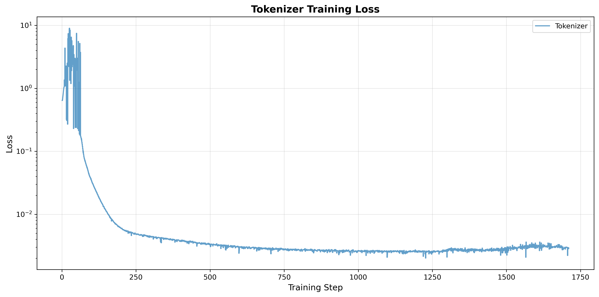
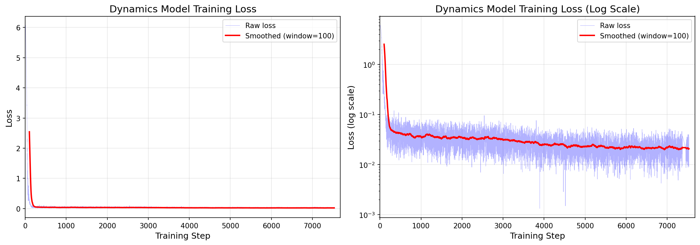

# Genie Training Pipeline

This document describes the training commands used to train each component of the Genie world model.

---

## 1. Train Video Tokenizer

**Run ID:** `run_20260102_104853`  
**Checkpoint Used:** `checkpoint_step_2288.pt`  
**Config:** `configs/tokenizer_config.yaml`

```bash
conda run -n robot_wm python -u scripts/train_tokenizer.py \
    --config configs/tokenizer_config.yaml \
    --data_dir data \
    --dataset pong \
    --device cuda \
    --max_steps 5000
```

**Notes:**
- Trained on Pong dataset with 128x72 resolution
- Uses VQ codebook with 512 codes
- Mixed precision training enabled
- Full training (upto 5k steps) doesn't fit the GPU memory. 
- Visual evaluation of reconstruction says that the model has learnt well
---

## 2. Train Latent Action Model (LAM)

**Run ID:** `run_20260103_073359`  
**Checkpoint Used:** `checkpoint_step_15000.pt`  
**Config:** `configs/lam_config_paper.yaml`

```bash
conda run -n robot_wm python -u scripts/train_lam.py \
    --config configs/lam_config_paper.yaml \
    --data_dir data \
    --dataset pong \
    --device cuda \
    --max_steps 30000
```

**Notes:**
- Uses paper hyperparameters (20 layers, 1024 d_model)
- 3-action codebook (up, down, do nothing) for Pong. Learns faster
- Trained to predict next frame from past frames

---

## 3. Train Dynamics Model

**Run ID:** `run_20260103_133845`  
**Config:** `configs/dynamics_config_3actions.yaml`  
**LAM Config:** `configs/lam_config_paper.yaml`

```bash
conda run -n robot_wm python -u scripts/train_dynamics.py \
    --config configs/dynamics_config_3actions.yaml \
    --lam_config configs/lam_config_paper.yaml \
    --tokenizer_path /media/skr/storage/robot_world/Genie/Genie_SKR/checkpoints/tokenizer/run_20260102_104853/checkpoint_step_2288.pt \
    --lam_path /media/skr/storage/robot_world/Genie/Genie_SKR/checkpoints/lam/run_20260103_073359/checkpoint_step_15000.pt \
    --data_dir data \
    --dataset pong \
    --device cuda \
    --max_steps 10000
```

**Notes:**
- Uses frozen tokenizer and LAM from previous stages
- MaskGIT-style training for next-token prediction
- 8 transformer layers, 640 d_model

---

# Loss Curves

## Tokenizer Training Loss
*Note: Training log for exact run not available, loss curve may be from a different run*



## LAM Training Loss (run_20260103_073359)


## Dynamics Training Loss (run_20260103_133845)



---

# Output Videos

## Tokenizer Reconstruction
- `evaluations/tokenizer/comparison_checkpoint_step_2288.mp4` - Short comparison
- `evaluations/tokenizer/comparison_checkpoint_step_2288_long_7seq.mp4` - Extended sequence

## LAM Prediction
- `evaluations/lam/visual_eval_step_15000_run_073359.mp4` - Next frame prediction

## Dynamics Generation
- `evaluations/dynamics/dynamics_comparison_step_7000.mp4` - Action-conditioned generation
- `evaluations/dynamics/long_video/dynamics_comparison_step_7000.mp4` - Extended generation


## Latent action model

15000 is shown to have the best metric as model starts overfitting 

<video controls src="evaluations/lam/visual_eval_step_15000_run_073359_segment2.mp4" title="Title"></video>

## Video Tokenizer

Checkpoint step 2288 - Original vs Reconstruction comparison:

<video controls src="evaluations/tokenizer/comparison_checkpoint_step_2288.mp4" title="Tokenizer Reconstruction"></video>

Extended sequence (7 frames):

<video controls src="evaluations/tokenizer/comparison_checkpoint_step_2288_long_7seq.mp4" title="Tokenizer Extended"></video>

## Dynamics model
<video controls src="evaluations/dynamics/long_video/dynamics_comparison_step_7000.mp4" title="Title"></video>